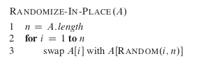
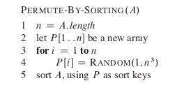
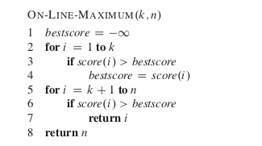

# Introduction to Algorithm Probabilistic Analysis

## 1/ Introduction

### 1.1/ Motivation:
- We have often heard of "average running time", which is calculated by taking average with respect to input drawn from a uniform distribution.

- For example, in quicksort if we always pick first element as pivot, then worst running time will be $O(n^2)$ (when input is already sorted). But when averaging across all possible input arrays, average running time will then become $O(n * log(n))$.

- Can we improve such that **for any given input**, the QuickSort algorithm will always renders an "expected" running time of $O(n * log(n))$?

- It is well known that by **picking a random element** as pivot in QuickSort, we might be able to avoid the worst case running time. **However, picking a pivot element randomly only once per iterations still results in expected running time of $O(n^2)$**

- Therefore, this article will introduce analysis to such scenarios. Two concepts will be introduced:
    + Indicator Random Variable is a useful method to calculate expected number of occured events.
    + Effectively permutate the input in case input needs to be drawn from a uniform distribution randomly.

### 1.2/ Concepts:

#### 1.2.1/ Indicator Random Variable:
- In short, this technique helps turn a list of different events probabilities to expected number of occurred events.

- Indicator Random Variable of event x is defined as:
$$ I(x)= 
\begin{cases}
    1,& \text{if } \text{event x happens}\\
    0,              & \text{otherwise}
\end{cases} 
$$

- Let's look at this basic example: We toss 10 fair coins, and calculate expected number of heads in total. By standard method, we need to calculate of probability of obtaining 1 head, 2 heads, 3 heads, ..., 10 heads then taking the weighted sum, which will be cumbersome.

- Instead, let's define $X$ as total number of heads obtained, $X_i$ as event that coin $i$ lands in head. Then:
$$
E[X] = E[X_1 + X_2 + ... + X_{10}] \\ 
= E[X_1] + ... + E[X_{10}] (*) \\
= (P(X_1 = 1) * I(X_1 = 1) + P(X_1 = 0) * I(X_1 = 0)) + ... \\
= \frac{1}{2} + ... \\
= 10 * \frac{1}{2} = 5
$$

**Note that in \*, we are using linearity of expectation, so each of the events must be independent.**

#### 1.2.2/ Permutating Input Array:

Prove this with induction.

## 2/ Examples:

### 2.1/ Hiring Employees:
- **Problem Formuation**: Given a list of candidates, we need to interview them one-by-one to hire the best applicant. At the end of each interview, if this new candidate is better than the the best candidate so far, we will fire the old one and hire this new employee. Each hire will cost $c_h$. Find expected total hiring cost of this algorithm.

- To solve this problem, we need to figure out expected number of hires for a random input array.

- If we assume applicant input order is uniformly random, we can calculate average running time. However, **if we preprocess input with the technique of array permutation as in 1.2.2, we can calculate expected running time regardless of input**.

- Let $X$ be the random variable whose value equals the number of times we hire a new applicant, and let $X_i$ be the indicator random variable associated with the event in which the $i_{th}$ candidate is hired.

- Candidate i is hired, exactly when candidate i is better than each of
candidates 1 through i - 1. Because we have assumed that the candidates arrive in
a random order, the first i candidates have appeared in a random order. Any one of
these first i candidates is equally likely to be the best-qualified so far. Candidate i has a probability of $\frac{1}{i}$ of being better qualified than candidates 1 through i - 1 and thus a probability of $\frac{1}{i}$ of being hired.

$$ 
E[X_i] = \frac{1}{i}
$$

$$
E[X] = E[\sum_{i=1}^N X_i] \\
     = \sum_{i=1}^N E[X_i] \\
     = \sum_{i=1}^N \frac{1}{i} \\
     = ln(n) + O(1) \\
     \text{(sum harmonic series)}
$$

### 2.2/ Probabilistic Quicksort:

- In quicksort, we hope to obtain this recurring formula after partition:

$$ T(N) = 2 * T(\frac{N}{2}) + O(N) $$

which is the ideal case if the pivot is also the array median. However, by just choosing a random element as pivot, we cannot have any guarantee on the expected partition of this random element.

First, note that we don't need to split perfectly into 50-50% like this to obtain final running time of O(N * log(N)). If the split ratio is not worse than 70-30 for example, then the final running time will still be O(N * log(N)).

$$ T(N) >= T(N * 0.3) + T(N * 0.7) + O(N) $$

So the question becomes:
**How to choose the pivot such that we can expect to partition the array at least 70-30**.

Strategy is simple: Pick a random pivot, partition, see if it satisfies. If not then repeat again.

Let's $X_i$ be the event that the $i_{th}$ trial succeeds. We know that :

$$
P[X_i] = 0.4 \text{(for all i)} \\
E[X1 + ... + X_k] = E[X1] + ... + E[X_k] \text{(each event is independent)} \\
= 0.4 * k
$$

So for E[X] at least 1, k needs to be at least 3. So we just repeat the pivot trial at least 3 times.

# 3/ Exercises:

1/ Another way of doing array permutation is as follow

Note that the above algorithm only runs correctly if priorities P are all unique.

Prove that probability for that to happen is at least $1 - \frac{1}{n}$

2/ On-line hiring problem:

Extension to above hiring algorithm, that we are only allowed to hire exactly once. We will follow this algorithm:

Find k such that probability to hire the most qualified applicant is maximized.